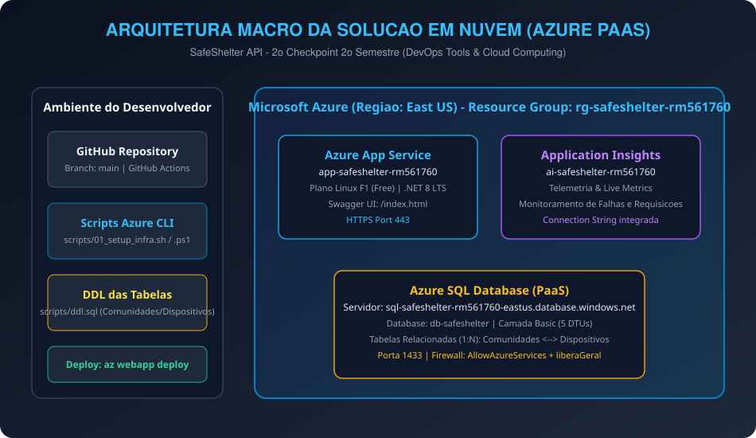
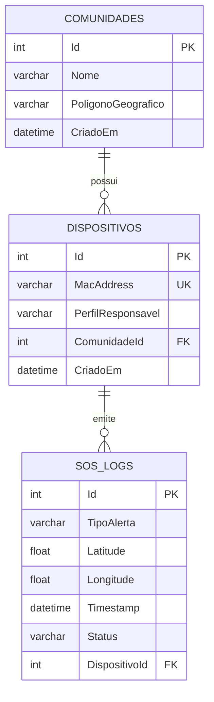

# SafeShelter - DevOps Tools & Cloud Computing (2º Checkpoint - 2º Semestre)

[](https://dotnet.microsoft.com/)
[](https://azure.microsoft.com/services/app-service/)
[](https://azure.microsoft.com/services/sql-database/)
[](https://azure.microsoft.com/services/monitor/)
[](https://learn.microsoft.com/cli/azure/)
[](https://github.com/features/actions)

Repositório técnico desenvolvido para o **2º Checkpoint do 2º Semestre da disciplina DevOps Tools & Cloud Computing** na FIAP (Prof. João Menk). A entrega contempla o desenvolvimento e publicação de uma aplicação Web em **.NET 8 (C#)** integrada com persistência em nuvem **Azure SQL Server (PaaS, não containerizado)**, automação completa de infraestrutura via **Azure CLI**, deploy automatizado (**GitHub Actions** e `az webapp deploy`), monitoramento com **Application Insights** e aderência estrita a todas as diretrizes de avaliação e prevenção de penalidades da atividade.

---

## 👥 Identificação dos Integrantes

| Nome Completo | RM |
| :--- | :--- |
| **Kaiky Pereira** | RM 564578 |
| **Leandro Guarido** | RM 561760 |
| **Gabriel Solano** | RM 562325 |

- **Repositório GitHub:** [https://github.com/rodrigueszkkk/DevOps-CP05.git](https://github.com/rodrigueszkkk/DevOps-CP05.git)
- **Vídeo Demonstrativo:** [Link do Vídeo no YouTube](https://youtu.be/IGRDf42g36U)
- **URL do Web App na Azure:** [https://app-safeshelter-rm561760.azurewebsites.net](https://app-safeshelter-rm561760.azurewebsites.net)
- **Swagger / OpenAPI Interativo:** [https://app-safeshelter-rm561760.azurewebsites.net/index.html](https://app-safeshelter-rm561760.azurewebsites.net/index.html)

---

## 📋 Sumário

1. [Descrição da Solução](#1-descrição-da-solução)
2. [Benefícios para o Negócio](#2-benefícios-para-o-negócio)
3. [Desenho Macro da Arquitetura em Nuvem](#3-desenho-macro-da-arquitetura-em-nuvem)
4. [Modelagem do Banco de Dados (Azure SQL PaaS)](#4-modelagem-do-banco-de-dados-azure-sql-paas)
5. [Endpoints da API e Exemplos JSON das Operações](#5-endpoints-da-api-e-exemplos-json-das-operações)
6. [Estrutura do Repositório](#6-estrutura-do-repositório)
7. [Tutorial Completo de Implantação em Nuvem (How To)](#7-tutorial-completo-de-implantação-em-nuvem-how-to)
8. [Monitoramento e Observabilidade (Application Insights)](#8-monitoramento-e-observabilidade-application-insights)

---

## 1. Descrição da Solução

O **SafeShelter** é um ecossistema inteligente de monitoramento, resposta rápida e gestão de áreas de vulnerabilidade socioambiental propensas a desastres naturais (inundações, deslizamentos de encostas e transbordamentos). 

A plataforma conecta sensores IoT instalados em campo com equipes de Defesa Civil e lideranças locais, garantindo:
- **Gestão Cadastral e Geográfica de Comunidades:** Mapeamento de perímetros de risco e áreas prioritárias.
- **Controle de Dispositivos e Sensores IoT:** Registro de nós de sensoriamento (ESP32) associados a responsáveis de campo.
- **Roteamento de Alertas de Emergência (SOS):** Recepção de chamados críticos georreferenciados para despacho imediato de socorro.

A solução foi construída em arquitetura de microsserviços em nuvem sobre a plataforma **Microsoft Azure**, utilizando computação elástica em **App Service** e dados relacionais em **Azure SQL Database (PaaS)**.

---

## 2. Benefícios para o Negócio

- **Alta Disponibilidade e Resiliência (PaaS):** Eliminação de gargalos com servidores físicos e contêineres manuais de banco; o Azure SQL PaaS oferece tolerância a falhas nativa e backups automáticos.
- **Resposta Rápida a Desastres:** Notificação em milissegundos a partir da telemetria de sensores, permitindo evacuação preventiva de vidas humanas.
- **Automação Completa (DevOps):** Provisionamento reproduzível via Azure CLI e esteira contínua com GitHub Actions, viabilizando novos deploys sem indisponibilidade.
- **Visibilidade Operacional 360°:** Rastreamento total de performance, latência de requisições e taxa de falhas com o Application Insights.

---

## 3. Desenho Macro da Arquitetura em Nuvem

A arquitetura foi projetada estritamente com serviços de Nuvem PaaS da Microsoft Azure, atendendo às exigências pedagógicas do professor e evitando diagramas genéricos ou inadequados (como fluxogramas ou TOGAF).



### Fluxo da Arquitetura
1. O desenvolvedor realiza o commit do código-fonte no **GitHub**.
2. O provisionamento e governança de recursos são executados via scripts **Azure CLI** (`scripts/01_setup_infra.sh` ou `.ps1`).
3. O deploy automatizado é acionado via esteira do **GitHub Actions** (ou pelo utilitário `az webapp deploy`).
4. O **Azure App Service (Web App Linux .NET 8)** atende as requisições HTTP/HTTPS (incluindo interface Swagger integrada).
5. As operações de CRUD persistem os dados diretamente no **Azure SQL Database (PaaS)** através de conexão criptografada (Porta 1433, TLS 1.2).
6. O **Application Insights** coleta telemetria, logs de requisições, métricas em tempo real (*Live Metrics*) e diagnósticos de falhas.

---

## 4. Modelagem do Banco de Dados (Azure SQL PaaS)

A persistência é realizada em um banco de dados **Azure SQL Server (PaaS, não containerizado)** na camada *Basic*. O modelo contempla entidades com integridade referencial estrita e cardinalidade `1:N`.



O arquivo texto contendo toda a DDL das tabelas, regras de integridade e dados iniciais encontra-se no diretório de entrega: [`scripts/ddl.sql`](scripts/ddl.sql).

---

## 5. Endpoints da API e Exemplos JSON das Operações

A API disponibiliza operações completas de **CRUD (Create, Read, Update, Delete)** em cada uma das tabelas relacionadas, em estrita conformidade com os requisitos da atividade.

Os payloads detalhados estão armazenados nos arquivos da pasta [`json/`](json/):
- [`json/comunidades.json`](json/comunidades.json)
- [`json/dispositivos.json`](json/dispositivos.json)
- [`json/emergencias_sos.json`](json/emergencias_sos.json)

### 5.1. Entidade 1: Comunidades (CRUD Completo)

| Método | Endpoint | Descrição |
| :--- | :--- | :--- |
| **GET** | `/api/v1/comunidades` | Lista todas as comunidades cadastradas |
| **GET** | `/api/v1/comunidades/{id}` | Busca os dados de uma comunidade por ID |
| **POST** | `/api/v1/comunidades` | Cadastra uma nova comunidade |
| **PUT** | `/api/v1/comunidades/{id}` | Atualiza o nome ou polígono de uma comunidade |
| **DELETE** | `/api/v1/comunidades/{id}` | Remove uma comunidade e seus vínculos em cascata |

#### Exemplo JSON - POST (Criar Comunidade)
```json
{
  "nome": "Comunidade Morro do Alemão - Bloco B",
  "poligonoGeografico": "-22.8590,-43.2730;-22.8600,-43.2740"
}
```

#### Exemplo JSON - PUT (Atualizar Comunidade)
```json
{
  "nome": "Comunidade Morro do Alemão - Bloco B (Atualizado)",
  "poligonoGeografico": "-22.8595,-43.2735;-22.8605,-43.2745"
}
```

---

### 5.2. Entidade 2: Dispositivos IoT (CRUD Completo com Foreign Key)

| Método | Endpoint | Descrição |
| :--- | :--- | :--- |
| **GET** | `/api/v1/dispositivos` | Lista todos os dispositivos e respectivas comunidades |
| **GET** | `/api/v1/dispositivos/{id}` | Busca dispositivo por ID |
| **POST** | `/api/v1/dispositivos` | Cadastra novo sensor IoT associado a uma comunidade |
| **PUT** | `/api/v1/dispositivos/{id}` | Atualiza os dados ou responsável do dispositivo |
| **DELETE** | `/api/v1/dispositivos/{id}` | Remove o dispositivo do sistema |

#### Exemplo JSON - POST (Criar Dispositivo)
```json
{
  "macAddress": "ESP32-DEV-9999",
  "perfilResponsavel": "Brigada Voluntária",
  "comunidadeId": 1
}
```

#### Exemplo JSON - PUT (Atualizar Dispositivo)
```json
{
  "macAddress": "ESP32-DEV-9999",
  "perfilResponsavel": "Brigada Voluntária - Turno Noite",
  "comunidadeId": 1
}
```

---

## 6. Estrutura do Repositório

O projeto segue rigorosamente o padrão de organização exigido pela disciplina:

```text
├── .github/
│   └── workflows/
│       └── deploy.yml              # Pipeline CI/CD automatizado no GitHub Actions
├── assets/
│   └── arquitetura_macro.svg       # Desenho macro da arquitetura em nuvem (Azure PaaS)
├── json/
│   ├── comunidades.json            # Exemplos JSON de GET, POST, PUT, DELETE
│   ├── dispositivos.json           # Exemplos JSON de GET, POST, PUT, DELETE
│   └── emergencias_sos.json        # Exemplos JSON de recepção e atualização de alertas
├── scripts/
│   ├── ddl.sql                     # Arquivo texto com a DDL completa e dados iniciais
│   ├── 01_setup_infra.sh           # Script Azure CLI de criação total de infraestrutura (Linux/macOS)
│   ├── 01_setup_infra.ps1          # Script Azure CLI de criação total de infraestrutura (PowerShell)
│   ├── 02_deploy_app.sh            # Script de deploy automatizado via az webapp deploy (Linux/macOS)
│   ├── 02_deploy_app.ps1           # Script de deploy automatizado via az webapp deploy (PowerShell)
│   ├── 03_cleanup.sh               # Script de exclusão de recursos na Azure (Linux/macOS)
│   └── 03_cleanup.ps1              # Script de exclusão de recursos na Azure (PowerShell)
├── src/
│   └── SafeShelter.API/            # Código-fonte completo da aplicação Web .NET 8
│       ├── Controllers/            # ComunidadesController, DispositivosController, EmergenciasController
│       ├── Data/                   # AppDbContext (Entity Framework Core com Azure SQL)
│       ├── DTOs/                   # DTOs de entrada e saída validados
│       ├── Models/                 # Entidades Comunidade, Dispositivo e SosLog
│       ├── Program.cs              # Inicialização, Swagger, App Insights e DI
│       └── SafeShelter.API.csproj  # Configuração de pacotes NuGet
├── .gitignore                      # Proteção de credenciais e arquivos de compilação
└── README.md                       # Tutorial How To completo e documentação oficial
```

---

## 7. Tutorial Completo de Implantação em Nuvem (How To)

### Pré-requisitos
- Conta ativa na Microsoft Azure com assinatura de estudante/educação.
- **Azure CLI** instalado localmente ou acesso ao **Azure Cloud Shell**.
- **.NET 8 SDK** e **Git** instalados.

---

### Passo 1: Autenticação na Azure CLI
Abra o terminal (Bash ou PowerShell) e execute a autenticação:

```bash
az login
```

Verifique e selecione a assinatura de uso:
```bash
az account list -o table
az account set --subscription "Nome-ou-ID-da-Subscrição"
```

---

### Passo 2: Criação da Infraestrutura em Nuvem (Scripts CLI)
Navegue até a raiz do repositório e execute o script de provisionamento automatizado da pasta `scripts/`:

**Opção Linux / macOS / Cloud Shell:**
```bash
chmod +x scripts/*.sh
./scripts/01_setup_infra.sh
```

**Opção Windows PowerShell:**
```powershell
.\scripts\01_setup_infra.ps1
```

O script criará de forma 100% automatizada:
1. O Resource Group `rg-safeshelter-rm561760` na região `eastus`.
2. O **Azure SQL Server** `sql-safeshelter-rm561760-eastus` e o banco `db-safeshelter` (Camada Basic).
3. As regras de firewall liberando tráfego do App Service e IP de demonstração.
4. O componente do **Application Insights** `ai-safeshelter-rm561760`.
5. O **App Service Plan** `plan-safeshelter-rm561760` (Linux F1 Free).
6. O **Web App** `app-safeshelter-rm561760` (.NET 8).
7. As Application Settings com a `ConnectionStrings__DefaultConnection` e a `APPLICATIONINSIGHTS_CONNECTION_STRING`.

---

### Passo 3: Execução da DDL no Banco de Dados Azure SQL
Para criar as tabelas e a carga inicial, execute o script [`scripts/ddl.sql`](scripts/ddl.sql).

Você pode executar diretamente pelo **Query Editor do Azure Portal**:
1. No Azure Portal, acesse o recurso `db-safeshelter`.
2. No menu lateral, clique em **Editor de consultas (versão prévia)**.
3. Faça login com o usuário `admin_dimdim` e a senha definida no script (`Fiap@2tdsvms2026!`).
4. Cole o conteúdo de `scripts/ddl.sql` e clique em **Executar**.

---

### Passo 4: Deploy Automatizado da Aplicação

#### Opção A: Deploy via Azure CLI (`az webapp deploy` - Aula 13 02)
Execute o script de build e deploy:

**Linux / macOS:**
```bash
./scripts/02_deploy_app.sh
```

**PowerShell:**
```powershell
.\scripts\02_deploy_app.ps1
```

#### Opção B: Deploy Contínuo via GitHub Actions (Aula 14 01)
1. No Azure Portal, acesse o Web App `app-safeshelter-rm561760` e clique em **Obter perfil de publicação** (*Get publish profile*).
2. No repositório GitHub, vá em **Settings** > **Secrets and variables** > **Actions**.
3. Crie um secret chamado `AZURE_WEBAPP_PUBLISH_PROFILE` e cole o conteúdo XML baixado.
4. Qualquer push na branch `main` dispara automaticamente o workflow `.github/workflows/deploy.yml`.

---

### Passo 5: Teste da Aplicação e Validação da Persistência

Acesse o endereço público da aplicação:
- **Swagger:** `https://app-safeshelter-rm561760.azurewebsites.net/index.html`

Realize as operações de teste:
1. `GET /api/v1/comunidades` -> Retorna as comunidades cadastradas.
2. `POST /api/v1/comunidades` -> Cadastra uma nova comunidade.
3. `POST /api/v1/dispositivos` -> Cadastra um novo dispositivo IoT vinculado à nova comunidade.
4. `PUT /api/v1/comunidades/{id}` -> Atualiza os dados.
5. `DELETE /api/v1/dispositivos/{id}` -> Remove o dispositivo.

**Validação Direta no Banco de Dados:**
Execute a consulta no Query Editor do Azure SQL para certificar a persistência:
```sql
SELECT * FROM Comunidades;
SELECT * FROM Dispositivos;
```

---

## 8. Monitoramento e Observabilidade (Application Insights)

O monitoramento da aplicação é realizado nativamente pelo **Azure Application Insights**:

1. No Azure Portal, acesse o recurso `ai-safeshelter-rm561760`.
2. Clique na aba **Métricas ao vivo (Live Metrics)**: visualize em tempo real a taxa de requisições por segundo, tempo de resposta e consumo de CPU.
3. Clique em **Falhas (Failures)** e **Desempenho (Performance)**: observe a telemetria detalhada de cada chamada HTTP aos controllers da aplicação e dependências de banco de dados.
